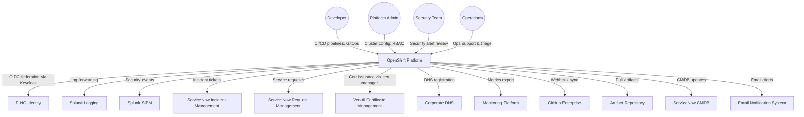

```mermaid
graph TD

    %% Human roles
    Developer(("Developer"))
    PlatformAdmin(("Platform Admin"))
    SecurityTeam(("Security Team"))
    Operations(("Operations"))

    %% Group roles near the top
    Developer -->|"CI/CD pipelines, GitOps"| OpenShift
    PlatformAdmin -->|"Cluster config, RBAC"| OpenShift
    SecurityTeam -->|"Security alert review"| OpenShift
    Operations -->|"Ops support & triage"| OpenShift

    %% Main system
    OpenShift["OpenShift Platform"]

    %% External systems (vertical spacing with ordering)
    OpenShift -->|"OIDC federation via Keycloak"| Ping["PING Identity"]

    OpenShift -->|"Log forwarding"| SplunkLogging["Splunk Logging"]

    OpenShift -->|"Security events"| SplunkSIEM["Splunk SIEM"]

    OpenShift -->|"Incident tickets"| ServiceNowInc["ServiceNow Incident Management"]

    OpenShift -->|"Service requests"| ServiceNowReq["ServiceNow Request Management"]

    OpenShift -->|"Cert issuance via cert-manager"| Venafi["Venafi Certificate Management"]

    OpenShift -->|"DNS registration"| DNS["Corporate DNS"]

    OpenShift -->|"Metrics export"| Monitoring["Monitoring Platform"]

    OpenShift -->|"Webhook sync"| GitHub["GitHub Enterprise"]

    OpenShift -->|"Pull artifacts"| ArtifactRepo["Artifact Repository"]

    OpenShift -->|"CMDB updates"| CMDB["ServiceNow CMDB"]

    OpenShift -->|"Email alerts"| EmailService["Email Notification System"]
```
